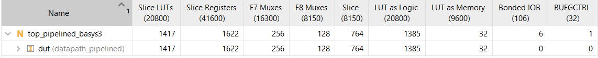
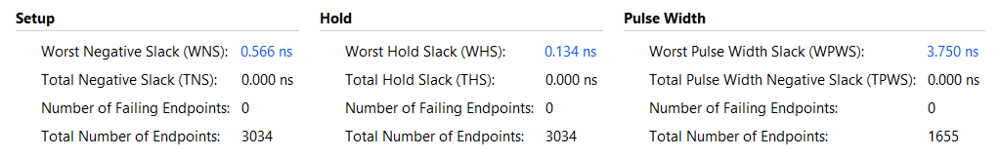
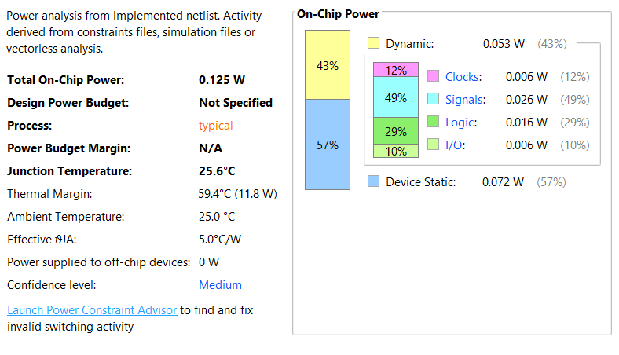

# risc-v

A RISC-V (RV32I subset) core implemented in SystemVerilog: a 5-stage
pipelined datapath with forwarding and hazard detection. (A single-cycle
version of the same core lives on the `master` branch.)

**Highlights**

- **5-stage pipeline** with EX/MEM and MEM/WB forwarding, load-use stalling,
  and flush-on-mispredict
- **Dynamic branch prediction** — 2-bit saturating-counter PHT plus a tagged BTB
- **Timing closure at 100 MHz** on a Basys 3 (Artix-7): +0.566 ns slack,
  ~106 MHz max, ~1.4k LUTs\*
- **Constrained-random UVM testbench** checked against
  [Spike](https://github.com/riscv-software-src/riscv-isa-sim) as a golden
  model, which caught decode bugs the directed tests missed
- **Directed hazard-matrix suite** covering every forwarding distance,
  stall/flush overlap, and forwarding-priority case
- **Custom two-pass assembler** (Python) used to build every test program

## Supported instructions

- R-type ALU: `ADD`, `SUB`, `AND`, `OR`, `XOR`, `SLT`, `SLL`, `SRL`, `SRA`
- I-type ALU: `ADDI`, `ANDI`, `ORI`, `XORI`, `SLTI`, `SLLI`, `SRLI`, `SRAI`
- `LW`, `SW`
- `BEQ`
- `LUI`, `AUIPC`
- `JAL`, `JALR`

`SLTU`/`SLTIU`, the other branch variants (`BNE`/`BLT`/`BGE`/`BLTU`/`BGEU`),
and `FENCE`/`ECALL`/`EBREAK` are intentionally out of scope.

## Layout

```
alu/                ALU and its opcode package (alu_pkg)
control_unit/       Main control unit + ALU control, opcode/alusrc/memreg package (control_pkg)
register/           32x32 register file (x0 hardwired to 0)
instruction_mem/    Instruction memory (reads program.hex)
data_mem/           Data memory
glue/               PC, adders, muxes, branch comparator, and immediate generator tying it together
pipeline_regs/      IF/ID, ID/EX, EX/MEM, MEM/WB pipeline registers
hazard/             forward_unit.sv (EX/MEM and MEM/WB forwarding) and
                    hazard_detect.sv (load-use stall detection)
branch_predictor/   pht.sv (2-bit saturating counters) and btb.sv (tagged branch target buffer)
datapath/           datapath_pipelined.sv, the top-level module wiring the whole core together
tests/              Testbenches for the core (see Testing, below)
top/                Board-level top module + XDC constraints for real FPGA bring-up
synth/              Yosys script for xc7 resource/logic-depth estimates outside Vivado
axi_lite/           Standalone AXI4-Lite master + testbench (not yet wired into the datapath)
uvm/                Constrained-random UVM environment checked against Spike (see below)
utils/              Two-pass assembler used to build the test programs
```

Each module under `alu/`, `control_unit/`, `register/`, `instruction_mem/`,
and `data_mem/` also has its own standalone testbench for unit-level
verification.

## Pipelining

`datapath_pipelined.sv` splits execution across 5 stages (fetch, decode,
execute, memory, writeback) connected by the pipeline registers in
`pipeline_regs/`. Three hazard classes need explicit handling:

**Data hazards (forwarding).** `hazard/forward_unit.sv` forwards a
producer's result to a consumer's EX stage without waiting for it to reach
the register file, from two points in the pipeline:

- **EX/MEM** — for a consumer immediately following its producer (0
  instructions apart)
- **MEM/WB** — for a consumer one instruction after its producer

EX/MEM takes priority when both could apply (e.g. the same destination
register written twice in a row). Store instructions get a separate
forwarding path (`fw_r2`) for the value being stored, since it's read
through `rs2` independent of whatever the ALU's second operand is doing —
without it, a store's data operand would never be forwarded when the store
uses an immediate for its address calculation.

Forwarding at the EX/MEM stage has to forward whatever the instruction will
*actually* write back, not just its raw ALU result — most instructions'
writeback value is their ALU result, but `LUI`/`JAL`/`JALR` write back
something else (the immediate, or the return address), and the ALU is still
computing its own equally-real-looking-but-architecturally-meaningless
result underneath. `datapath_pipelined.sv` reuses `writeback_mux` a second
time at the EX/MEM stage to compute the correct forwarded value before it
reaches `forward_unit.sv`.

**Load-use hazards (stalling).** A value loaded by `LW` isn't available
until the MEM stage, one stage later than an ALU result — so a consumer
immediately following a load can't be resolved by forwarding alone.
`hazard/hazard_detect.sv` detects this (a load in ID/EX whose destination
matches either source register of the instruction in IF/ID) and asserts
`stall`, which freezes the PC and IF/ID register for one cycle while a
bubble is inserted into ID/EX.

**Control hazards (flushing).** A branch or jump is only resolved in EX,
two stages after it was fetched. Fetch follows the branch predictor's guess
(see *Branch prediction*, below); when EX finds that guess was wrong — a
taken branch/JAL/JALR that wasn't predicted taken with the right target, or
a branch predicted taken that wasn't — `datapath_pipelined.sv` asserts
`flush`, squashing the wrongly-fetched instructions and redirecting the PC
to the real target (or back to the branch's `pc + 4`). `flush` and the load-use
`stall` bubble are separate signals — IF/ID needs to *hold* during a stall
(it already has its own `stall` input for that) but *flush* on a
mispredict, so a single combined signal driving both stall and flush would
zero out the instruction IF/ID is supposed to be holding.

`flush` doesn't force any pipeline register's data fields to a squashed
value directly — each pipeline register instead carries a `valid` bit,
set by `flush` at capture time and passed through unchanged by every
later stage. Whatever a squashed instruction's `regw`/`memw`/`branch`/
`memregpc` fields happen to hold is only ever acted on after being ANDed
with the matching `valid` bit, at each real point of consequence
(`branch_taken`, `forward_sel`'s two forwarding-eligibility checks, and
both `wenable`s). This exists because `flush` sits at the end of a long
combinational chain (forwarding → ALU → branch decision) and forcing it
to fan out to every field of a wide pipeline register directly was the
dominant cost in the design's critical path; a single `valid` bit costs
far less to distribute; a dedicated `branch_compare` module also
computes the branch condition directly (`a == b`) instead of routing it
through the general ALU, for the same reason.

## Branch prediction

`BEQ` is predicted dynamically in fetch by two structures in
`branch_predictor/`, both looked up with the current fetch PC:

- **`pht.sv`** — a 32-entry pattern history table of 2-bit saturating
  counters, indexed by `pc[6:2]` and reset to strongly-not-taken. It
  answers *whether* to take the branch.
- **`btb.sv`** — a 16-entry, direct-mapped, tagged branch target buffer.
  It answers *where* to go; a tag mismatch is a miss, so an unrelated
  instruction aliasing to the same index is never redirected.

Fetch redirects to the BTB's target only when the BTB hits *and* the PHT
predicts taken; otherwise it falls through to `pc + 4`. The branch's
prediction (`predict_taken`, `hit`, `target`) travels down the pipeline
alongside it, and EX compares it against the real outcome to decide
whether to `flush` (see *Control hazards*, above).

Both tables are trained from EX, using only valid `BEQ`s: the PHT counter
moves toward the actual outcome on every executed `BEQ`, and the BTB
records the target of every taken one. The BTB is written with
`branch_target` — the target EX just computed — not `pc_next`. The two
only agree on a mispredict: on a *correct* prediction there's no flush,
so `pc_next` is whatever fetch is doing that cycle, and training on it
would make each correct prediction overwrite its own BTB entry with a bad
target. The BTB's write port is registered one cycle before it touches the
table to keep this path out of the critical path. `JAL`/`JALR` aren't
predicted yet; every taken jump costs a flush.

The predictor only affects performance, never correctness — a
misprediction is recovered by the same flush that would otherwise handle an
unpredicted branch — so the pass/fail testbenches in `tests/` can't tell a
working predictor from a broken one. To check it, count flushes: a 20-iteration
`BEQ` loop should mispredict 3 times (twice while the counter warms up from
strongly-not-taken, once on loop exit).

## Testing

`tests/` holds testbenches for the core, each loading its own program
image and reporting pass/fail per check plus a final summary:

- **`skeleton_tb.sv`** — smoke test for the datapath skeleton before
  forwarding/hazard handling existed: ADDI/ADD/SW/LW and a taken BEQ, with
  instructions spaced far enough apart to avoid needing forwarding at all.
- **`forward_tests.sv`** — targeted forwarding coverage: EX/MEM and MEM/WB
  forwarding into both ALU operands, store-data forwarding (`fw_r2`) at
  both distances, forwarding priority, and forwarding into both operands of
  a branch comparison.
- **`complete_tests.sv`** — a full-pipeline stress test covering every
  supported instruction, checkpointed to memory (since instruction memory
  is capped at 64 words, results need to survive register reuse) plus
  explicit load-use stalling, store-data forwarding, forwarding priority,
  branch-operand forwarding, and a flush immediately followed by a
  load-use stall.
- **`hazard_matrix_tests.sv`** — the exhaustive version, split into 5
  independent phases (each under the 64-word instruction limit,
  sequentially loaded and run against a freshly reset DUT) covering: every
  forwarding distance for rs1, rs2, and both simultaneously; a fully
  chained dependency (every instruction depending on the one immediately
  before it, back to back); forwarding priority; back-to-back independent
  load-use stalls; `fw_r2` at both distances; branch operands forwarded
  from both EX/MEM and MEM/WB feeding a same-cycle taken decision; a
  taken branch immediately overlapping a load-use stall (including the
  stalled instruction being the branch itself); the `rd != 0` forwarding
  guard; JAL/JALR forwarding into an immediately-dependent instruction; and
  a regression test for the EX/MEM-forwarding-must-respect-writeback-value
  bug described above (a poisoned register bleeding into a 0-gap-forwarded
  `LUI` result).

## Assembler

`utils/assembler.py` is a small two-pass RV32I assembler covering every
instruction the datapath supports (see above). It reads `program.txt` from
the current directory and writes the assembled machine code to `program.hex`,
one 8-digit hex word per line, ready to be loaded by `instruction.sv`. It's
also what generated every `.hex` program used by the tests in `tests/` —
those are gitignored build artifacts; the testbenches embed their assembly
source in a header comment instead.

Syntax mirrors standard RISC-V assembly, e.g.:

```
    addi x1, x0, 5
    add  x3, x1, x2
    sw   x1, 0(x0)
    lw   x22, 0(x0)
beq_target:
    beq  x1, x2, beq_target
    jal  x25, some_label
    jalr x26, some_label(x0)
    lui  x23, 0x12345
```

Labels are any token ending in `:`, resolved in a first pass before machine
code is generated; `beq`/`jal` immediates are computed as PC-relative
offsets from the label address, while `jalr`'s immediate is `rs1 + imm`
as usual (only PC-relative automatically when the label is combined with a
`0` base, since `jalr`'s own immediate is never PC-relative by definition).

Run it from the directory containing `program.txt`:

```sh
python3 utils/assembler.py
```

## Memory

Both instruction and data memory are 64 words (256 bytes) deep, word-addressed
via `addr[7:2]`. Addresses at or beyond `0x100` wrap around instead of
erroring, so keep program code and data within that range — it's the reason
the tests either checkpoint results to memory and reuse registers, or split
into multiple independently-loaded phases, rather than writing one long
program.

Neither the register file nor data memory clear their storage on `reset` —
only the pipeline registers and PC do. A synchronous reset that clears an
entire memory array every cycle prevents an FPGA synthesis tool from
mapping it to a real distributed-RAM/BRAM primitive (no such primitive can
bulk-clear itself), forcing a much more expensive flip-flop-based
implementation instead. Real hardware still comes up zeroed on power-on
regardless (Xilinx FPGAs zero-initialize BRAM/LUTRAM by default), so this
only changes behavior for a *second* reset mid-run, which matches how real
CPUs treat general-purpose registers anyway (undefined after reset, not
architecturally guaranteed to be zero). The testbenches compensate for this
in simulation by explicitly clearing both hierarchically wherever a test
needs a guaranteed-fresh DUT (Icarus doesn't model power-on-zero the way
real silicon does).

## UVM environment (in progress)

`uvm/` holds a constrained-random UVM testbench, checked against
[Spike](https://github.com/riscv-software-src/riscv-isa-sim) (added as a
git submodule) as an independent golden model.

**Spike patch (required).** Spike unconditionally reserves address
`0x0`–`0xFFF` for its debug module (`bus.add_device(DEBUG_START, ...)`
in `riscv/sim.cc`, `DEBUG_START` is `0x0` in `riscv/platform.h`), with
no command-line flag to disable it. This project doesn't use Spike's
debug/JTAG features at all, and needs address `0` free so Spike's
memory map can match the DUT's own zero-based addressing. The one-line
fix is saved as `uvm/golden_model/patches/disable_debug_module.patch`.
Run `uvm/golden_model/setup_spike.sh` (idempotent — safe to re-run) to
init the submodule, apply the patch, and build in one step, rather than
driving `configure`/`make` by hand — a fresh submodule checkout has the
patch un-applied, and nothing else enforces re-applying it before a
plain `make` would silently build the unpatched, broken version.

**Addressing.** The generator's 64-word program is assembled and linked
to start at address `0x0` — identical to the DUT's own instruction
memory — so branch/jump targets and PC-derived register values (`JAL`'s
return address, `AUIPC`'s `pc + imm`) match the DUT exactly, with no
translation needed. A small fixed epilogue (`lui x31, 0x80010` then
`jal x0, _start`) runs *after* the 64 real words, at a known fixed
address, and jumps back to `0x0` before anything else executes — so the
real program is never shifted by this setup code either. The
scoreboard's trace parser ignores commits at or past that epilogue
address (`>= 0x100`) when building its expected-results queue.

Data addresses are the one exception, and need a real workaround: Spike
is a single unified address space, while the DUT has physically
separate instruction and data memories that happen to share the same
*numeric* addresses — so data can't also live at `0x0` in Spike without
aliasing the program's own instruction bytes (a store could silently
corrupt code Spike would later re-fetch, something that can never
happen on the real, Harvard-architecture DUT). Data instead lives at
`0x80010000` in Spike, and `LW`/`SW` are constrained to always address
relative to `x0` (never a forwarded/computed base register) so the
generator can predictably rewrite that `x0` to `x31` — pre-loaded with
the real base by the epilogue — when translating for Spike specifically.
This narrows what the *randomized* environment can generate for
memory-op addressing — forwarded/computed store and load addresses are
still covered exhaustively by the hand-written tests in `tests/`.

`JALR` is constrained the same way (`rs1` forced to `x0`), but for a
different reason: its `rs1 + imm` target now matches the DUT correctly
regardless of what `rs1` holds (code addressing is identical on both
sides), but a dynamic, uncontrolled `rs1` could still produce a target
that isn't 4-byte aligned, which Spike (strict RV32I, no compressed-
instruction extension) traps on — `BEQ`/`JAL`/`JALR` immediates are all
constrained to keep targets 4-byte aligned for the same reason.

**Results.** Random testing against Spike caught real correctness bugs
invisible to the existing directed tests — most notably, the control
unit accepted illegal branch/`JALR` encodings that real RV32I (and
Spike) reject outright. With those fixed, ~60% of random seeds now run
fully clean end to end; the rest hit a known limitation in Spike itself
(its trace goes silent on tight repeating loops without a `tohost`
handshake) rather than a DUT bug. Functional coverage (opcode / funct3 /
`x0`-as-source-or-dest) lands between 81% and 100% per seed.

## Building and running

Simulated with [Icarus Verilog](http://iverilog.icarus.com/). Run from the
repo root:

```sh
iverilog -g2012 -o sim \
  alu/alu_pkg.sv control_unit/control_pkg.sv \
  alu/alu.sv register/register.sv instruction_mem/instruction.sv data_mem/data.sv \
  control_unit/control.sv \
  glue/pc.sv glue/pc_plus4.sv glue/branch_adder.sv glue/imm_gen.sv \
  glue/alu_src_mux.sv glue/pc_reg_mux.sv glue/jalr_adder_mux.sv \
  glue/writeback_mux.sv glue/pc_next_mux.sv glue/branch_compare.sv \
  hazard/forward_unit.sv hazard/hazard_detect.sv \
  pipeline_regs/if_id_reg.sv pipeline_regs/id_ex_reg.sv pipeline_regs/ex_mem_reg.sv pipeline_regs/mem_wb_reg.sv \
  branch_predictor/pht.sv branch_predictor/btb.sv \
  datapath/datapath_pipelined.sv tests/hazard_matrix_tests.sv

vvp sim
```

Swap `tests/hazard_matrix_tests.sv` for any other testbench in `tests/` to
run it instead. This produces a `.vcd` waveform dump, viewable with a
viewer such as GTKWave.

## Synthesis

`synth/xc7_datapath_pipelined.ys` is a Yosys script targeting Xilinx
7-series (`synth_xilinx -family xc7`), used for resource/logic-depth
estimates independent of Vivado. See the comments at the top of the script
for usage and its known caveats (it needs `read_slang` rather than the
built-in `read_verilog -sv`, and a couple of flags to match this design's
coding style — both explained inline).

## Hardware bring-up

`top/top_pipelined_basys3.sv` is a thin wrapper exposing `clk`/`reset`/
`leds` for a real board — `datapath_pipelined`'s only observable output is
`leds` (the low 4 bits of the current PC), which exists purely so a real
synthesis run has something to keep instead of optimizing the whole design
away as unobservable dead logic. `top/basys3.xdc` has the matching pin
constraints (clock, center pushbutton for `reset`, 4 LEDs) for a Digilent
Basys 3 board — swap the `PACKAGE_PIN` values for a different board's
pinout.

## Implementation results (Vivado)\*

`top_pipelined_basys3` implemented in Vivado for the Basys 3's Artix-7
(`xc7a35t`, `-1` speed grade) with the 100 MHz board clock
(`top/basys3.xdc`, 10.00 ns period).

**Utilization** — 1417 LUTs (~6.8% of the 20800 available), 1622 flip-flops
(~3.9% of 41600), and 6 bonded IOBs. At 64 words deep each, the register file
and data memory map to distributed/LUT RAM (32 LUTs as memory) rather than
BRAM.



**Timing** — all constraints met: WNS +0.566 ns, WHS +0.134 ns, WPWS
+3.750 ns, 0 failing endpoints across 3034 setup endpoints. The +0.566 ns
setup slack at a 10 ns period corresponds to a max clock of roughly 106 MHz;
the critical path runs from the EX/MEM ALU-result register through the
forwarding path and back. Getting here took the pipeline changes described
under *Control hazards* above plus Vivado's performance-oriented
implementation strategy (see the commit history).



**Power** — 0.125 W total on-chip (0.053 W dynamic, 0.072 W device static)
from vectorless analysis.



<sub>\* Measured before the branch predictor was added.</sub>
